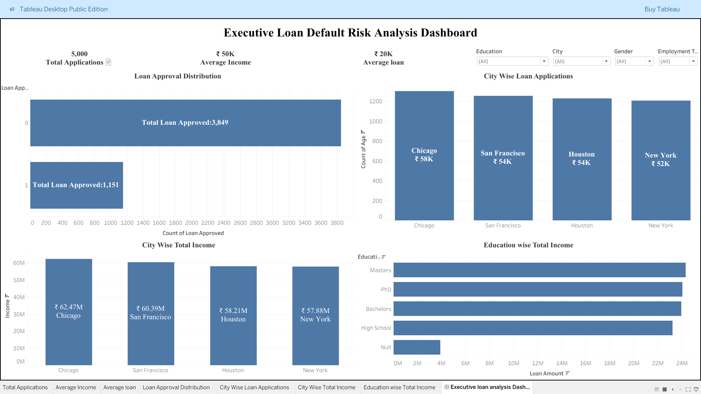

# Executive Loan Default Risk Analysis Dashboard

## Project Overview

This project is an end-to-end banking analytics solution designed to analyze customer loan applications, identify high-risk borrowers, improve approval decisions, and reduce loan default risk using data analytics and business intelligence tools.

The main objective of this project is to help banks and financial institutions make smarter lending decisions by understanding borrower behavior, approval patterns, income trends, and credit risk indicators.

This project simulates real-world financial analytics use cases relevant for leading banking and finance companies such as JPMorgan Chase, American Express, Bajaj Finance, Goldman Sachs, Wells Fargo, and other financial institutions.

---

## Business Problem

Banks face major challenges in identifying risky customers before approving loans. Poor lending decisions can result in loan defaults, financial losses, increased operational risk, and reduced profitability.

This project helps solve that problem by building a complete analytics workflow that focuses on:

* customer loan approval analysis
* borrower income behavior
* loan amount and repayment risk
* credit score risk identification
* city-wise application trends
* employment and education impact
* high-risk customer segmentation
* approval optimization strategies

The dashboard provides management-level visibility for better and faster decision-making.

---

## Tools Used

### SQL

Used for data extraction, querying, loan approval analysis, customer segmentation, and business KPI generation.

### Python

Used for data cleaning, preprocessing, handling missing values, duplicate removal, and data preparation for dashboard development.

### Power BI

Used for building interactive executive dashboards with KPI cards, slicers, business insights, and decision-making visuals.

### Tableau

Used for executive-level visualization, city-wise analytics, approval distribution analysis, and management reporting.

### Excel

Used for MIS reporting, pivot tables, KPI tracking, slicers, and business reporting dashboards.

### GitHub

Used for project portfolio presentation and recruiter-facing professional visibility.

---

## Key KPIs

The dashboard tracks the most important business KPIs:

* Total Applications
* Approval Rate
* Average Income
* Average Loan Amount
* High Risk Customers
* Credit Score Analysis
* Loan Approval Distribution
* City-wise Loan Performance

These KPIs help decision-makers quickly understand the health of the lending process.

---

## Dashboard Visuals

### Power BI Dashboard

* Loan Approval Distribution
* City-wise Loan Applications
* Income vs Loan Amount Analysis
* Gender-wise Customer Analysis
* Employment Type Analysis
* Interactive Slicers
* KPI Cards
* Executive Summary Box

### Tableau Dashboard

* Loan Approval Distribution
* City-wise Total Income
* Education-wise Total Income
* City-wise Loan Applications
* Approval Insights
* Executive-Level KPI Monitoring

### Excel Dashboard

* Pivot Tables
* KPI Cards
* Interactive Slicers
* MIS Reporting Layout
* Executive Business Summary

These dashboards are designed using real-world recruiter expectations for banking analyst roles.

---

## Business Insights

The analysis generated the following important insights:

* Salaried customers show higher loan approval rates
* Low credit score customers have higher rejection probability
* Metro cities generate maximum loan applications
* Higher income significantly improves approval likelihood
* Employment type strongly impacts lending decisions
* Education level affects repayment reliability
* High-risk customer identification helps reduce future defaults

These insights help improve lending strategy and business performance.

---

## Business Impact

This project improves:

* lending decision quality
* customer risk identification
* approval efficiency
* credit risk monitoring
* executive business intelligence reporting
* customer segmentation strategy
* loan default prevention strategy
* financial risk reduction

This creates direct business value for financial institutions.

---

## Executive Summary

This project demonstrates how modern data analytics improves banking operations by combining SQL, Python, Power BI, Tableau, Excel, and GitHub into one complete end-to-end analytics workflow.

The solution helps financial institutions make faster, smarter, and lower-risk lending decisions while improving customer quality and reducing financial exposure.

This project reflects the type of real-world analytics work performed in top financial institutions and strengthens readiness for analyst roles in banking and finance.

---

## Resume Impact Statement

Built an end-to-end banking analytics dashboard for loan default risk assessment using SQL, Python, Power BI, Tableau, and Excel to identify high-risk customer segments and improve lending decisions for financial institutions.

---

## Project Folder Structure

Executive-Loan-Default-Risk-Analysis-Dashboard
│
├── dataset
│   └── loan_data.csv
│
├── sql
│   └── loan_analysis_queries.sql
│
├── python
│   └── data_cleaning.py
│
├── powerbi
│   └── loan_analysis_dashboard.pbix
│
├── tableau
│   └── executive_loan_dashboard.twbx
│
├── excel
│   └── Executive_Loan_Default_Risk_Analysis.xlsx
│
├── images
│   └── dashboard_screenshot.png
│
└── README.md

---

## Dashboard Preview

### Power BI Dashboard

---

### Tableau Dashboard

---

### Excel Dashboard

---

## Author

Vishal Singh

Junior Data Analyst
Banking Analytics | Business Intelligence | Data-Driven Decision Making
Focused on solving business problems using analytics, dashboards, and strategic insights for data-driven decision making.
