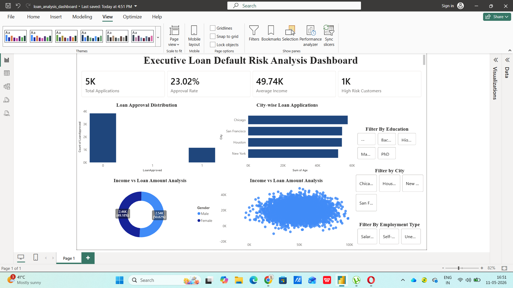

# 💳 Executive Loan Default Risk Analysis Dashboard

### Enterprise-Grade Credit Risk Intelligence & Financial Analytics Platform

<p align="center">
  
  
  
  
  
</p>

---

# 📌 Executive Overview

Financial institutions process thousands of loan applications daily, making proactive credit risk assessment and loan default monitoring essential for maintaining financial stability and minimizing exposure.

This project simulates an enterprise-grade **Executive Loan Default Risk Analysis Dashboard** designed to help financial organizations:

* Monitor loan default risk
* Analyze borrower behavior patterns
* Track financial exposure
* Identify high-risk customer segments
* Improve lending decision-making
* Support executive-level financial reporting

The solution combines **Power BI dashboards**, **SQL analytics**, **Python-based data processing**, and **risk-focused KPI engineering** to deliver actionable financial intelligence.

---

# 🎯 Business Problem

Banks and lending institutions often face challenges such as:

* Increasing loan default rates
* Limited borrower risk visibility
* Delayed financial reporting
* Fragmented credit analysis
* Poor loan portfolio monitoring
* Inefficient risk assessment workflows

Traditional reporting systems fail to provide centralized and proactive loan risk intelligence needed for strategic lending operations.

This project addresses these challenges through a scalable financial risk analytics framework.

---

# 💼 Key Business Objectives

✔ Monitor loan default risk trends
✔ Analyze borrower financial behavior
✔ Identify high-risk customer segments
✔ Improve lending visibility
✔ Track loan portfolio performance
✔ Deliver executive-ready risk KPIs
✔ Support data-driven credit decisions

---

# 🧠 Core Analytics Features

## ⚠ Loan Default Risk Analytics

* High-risk borrower identification
* Loan default probability analysis
* Credit exposure monitoring
* Risk segmentation reporting

## 💰 Financial Portfolio Analytics

* Loan portfolio performance tracking
* Revenue & repayment analysis
* Loan approval trend monitoring
* Financial exposure analysis

## 👥 Borrower Intelligence

* Customer segmentation analysis
* Income vs default risk tracking
* Credit behavior analysis
* Loan repayment insights

## 📈 Executive Reporting

* Dynamic KPI dashboards
* Financial risk summaries
* Portfolio trend analysis
* Operational risk reporting

---

# 🛠 Tech Stack

| Technology        | Purpose                                        |
| ----------------- | ---------------------------------------------- |
| **Power BI**      | Interactive dashboarding & financial reporting |
| **Tableau**       | Advanced data visualization & storytelling     |
| **Python**        | Data preprocessing & analytical workflows      |
| **SQL**           | Financial querying & risk analytics            |
| **Excel / CSV**   | Raw financial datasets                         |
| **DAX**           | KPI calculations & business measures           |
| **Data Modeling** | Relationship management & schema optimization  |

---

# 📂 Project Structure

```bash id="4f5t9w"
Executive-Loan-Default-Risk-Analysis-Dashboard/
│
├── Dataset/
│   ├── loan_data.csv
│   ├── customer_credit_data.csv
│
├── Python/
│   ├── loan_analysis.ipynb
│   ├── preprocessing.py
│
├── SQL/
│   ├── risk_queries.sql
│
├── Dashboard/
│   ├── loan_default_dashboard.pbix
│   ├── loan_default_dashboard.twb
│
├── Images/
│   ├── dashboard_preview.png
│
└── README.md
```

---

# 📊 Dashboard Highlights

## Executive KPI Dashboard

* Total Loan Applications
* Default Risk Percentage
* Loan Approval Metrics
* Financial Exposure Indicators
* Portfolio Performance KPIs

## Credit Risk Dashboard

* High-risk borrower analysis
* Default trend monitoring
* Loan category risk segmentation
* Exposure tracking

## Borrower Analytics Dashboard

* Income vs default analysis
* Customer behavior insights
* Credit score segmentation
* Repayment pattern monitoring

## Financial Intelligence Dashboard

* Portfolio performance analysis
* Revenue tracking
* Loan distribution monitoring
* Risk trend analysis

---

# 🔍 Advanced Analytics

## High-Risk Borrower Analysis

```sql id="d0n6y1"
SELECT customer_id,
       AVG(default_probability) AS risk_score
FROM loan_data
GROUP BY customer_id
ORDER BY risk_score DESC;
```

## Loan Portfolio Analysis

```sql id="h8j2re"
SELECT loan_category,
       SUM(loan_amount) AS total_loan_value
FROM loan_data
GROUP BY loan_category
ORDER BY total_loan_value DESC;
```

---

# 🐍 Python Data Processing

## Loan Risk Data Preprocessing

```python id="8v6fmk"
import pandas as pd

df = pd.read_csv("loan_data.csv")

# Handling missing values
df.fillna(0, inplace=True)

# Default ratio calculation
df['default_ratio'] = df['loan_default'] / df['loan_amount']

# Date conversion
df['loan_issue_date'] = pd.to_datetime(df['loan_issue_date'])
```

Python was used for:

* Financial data preprocessing
* Feature engineering
* Risk metric calculations
* Dataset transformation
* Analytical preparation workflows

---

# 📈 Quantified Business Metrics

| Metric                        | Performance                               |
| ----------------------------- | ----------------------------------------- |
| 💳 Loan Records Analyzed      | 75K+ financial loan records               |
| 💰 Loan Portfolio Processed   | ₹100M+ simulated loan exposure analyzed   |
| 📊 KPI Metrics Developed      | 20+ financial risk KPIs                   |
| ⚠ Risk Segments Identified    | Multiple borrower risk categories         |
| 📈 Dashboard Pages Built      | 4+ interactive executive dashboards       |
| 🧠 Analytical Queries Written | Advanced SQL & DAX financial calculations |
| 🚀 Data Processing Workflow   | Automated preprocessing using Python      |
| 🔍 Credit Risk Monitoring     | Centralized default risk visibility       |
| 📋 Portfolio Analytics        | Enterprise-level financial reporting      |
| ⚡ Decision Intelligence       | Faster risk-focused executive reporting   |

---

# 📌 Key Insights Generated

✔ High loan exposure segments demonstrated elevated default probability
✔ Borrower income patterns strongly influenced repayment behavior
✔ Certain loan categories contributed disproportionately to portfolio risk
✔ Credit segmentation improved default monitoring visibility
✔ Executive dashboards enhanced lending decision-making efficiency
✔ Centralized analytics improved financial risk reporting workflows

---

# 🚀 Business Value

This system demonstrates how financial risk analytics can:

* Improve credit risk visibility
* Strengthen loan portfolio monitoring
* Support data-driven lending decisions
* Enhance borrower risk analysis
* Deliver executive-level financial intelligence
* Improve operational reporting efficiency

---

# 🏆 Skills Demonstrated

## Data Analytics

* Financial risk analytics
* Credit intelligence
* KPI engineering
* Trend analysis
* Portfolio reporting

## Technical Skills

* Power BI
* Tableau
* Python
* SQL
* DAX
* Data modeling
* Dashboard engineering
* Financial visualization

## Business Understanding

* Credit risk analysis
* Loan portfolio management
* Financial operations
* Risk segmentation
* Executive reporting

---

# 📷 Dashboard Preview

## Executive Loan Risk Intelligence Dashboard

> 
> 

```markdown id="6fhw1v"

```

---

# 📌 Why This Project Stands Out

Unlike generic dashboard projects, this solution demonstrates:

✅ Enterprise-style financial risk analytics
✅ Credit-focused business intelligence
✅ Executive reporting architecture
✅ Strong financial storytelling
✅ Production-oriented dashboard design
✅ Real-world lending analytics use cases
✅ KPI-driven risk intelligence framework

This project aligns closely with roles such as:

* Financial Data Analyst
* Risk Analyst
* Credit Risk Analyst
* Business Intelligence Analyst
* Financial Reporting Analyst
* Data Analyst

---

# 🔮 Future Enhancements

* Real-time credit monitoring
* ML-based default prediction
* Automated risk alerts
* Predictive borrower analytics
* API-driven financial dashboards
* AI-driven credit scoring
* Cloud-based deployment

---

# 👨‍💻 Author

# Vishal Singh

Aspiring Data Analytics Professional specializing in:

* Financial Risk Analytics
* Credit Intelligence
* SQL Analytics
* Executive Dashboarding
* Business Intelligence
* KPI Engineering

---

# ⭐ Support The Project

If you found this project valuable, give this repository a ⭐ to support the work and showcase appreciation.

---

# 📬 Connect With Me

* GitHub: https://github.com/vishaaaal15
* LinkedIn: https://www.linkedin.com/in/vishal-singhdataanalyst

---

# 🔥 Recruiter Snapshot

### This project demonstrates:

✔ Financial risk analytics capability
✔ Executive dashboard development
✔ Credit intelligence reporting
✔ Strong KPI engineering
✔ Enterprise-style project presentation
✔ Production-level portfolio quality
✔ Data-driven financial storytelling
✔ Multi-tool analytics expertise (Power BI, Tableau, Python, SQL)

> Designed to reflect real-world financial risk analytics and enterprise lending intelligence workflows.
